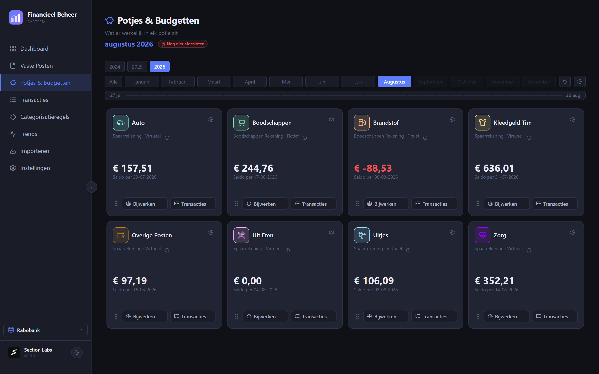
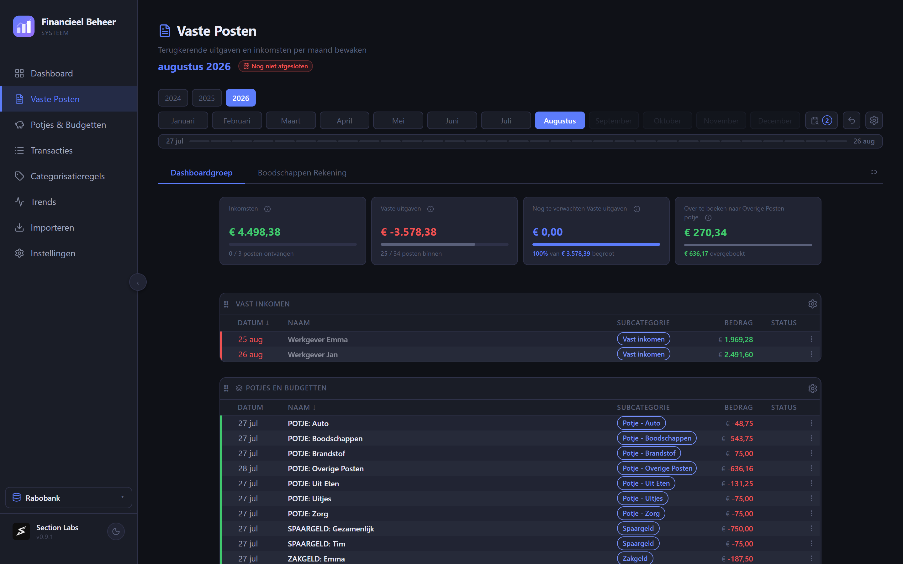

# FBS-Server

**Dezelfde financiële administratie, op al je apparaten. Op je eigen NAS.**

FBS is een Nederlandstalig programma voor je eigen financiën: je leest de
bestanden in die je bij je bank downloadt, en FBS maakt daar een overzicht van.
Wat er binnenkwam, waar het heen ging, wat er nog moet komen en wat je nog te
besteden hebt.

FBS-Server is de versie die op je eigen NAS of server draait. Je administratie
staat dan op één plek, en je laptop, je vaste computer en elk ander apparaat
werken met diezelfde gegevens. Wie iets wijzigt, wijzigt het voor iedereen.


---

## Wat FBS voor je doet

**Je boekingen, ingedeeld.** Elke boeking krijgt een categorie en een
subcategorie. Dat hoef je maar één keer per winkel of instantie te doen: FBS
maakt er een regel van en deelt de volgende keer vanzelf in.


**Potjes en budgetten.** Geld dat je apart zet voor de auto, boodschappen of
uitjes, of dat nu op een echte spaarrekening staat of alleen op papier. FBS
houdt bij wat erin zit en wat je er deze maand nog van over hebt.



**Vaste lasten bewaken.** FBS weet welke posten elke maand horen te komen, laat
zien welke al binnen zijn, en wijst je op bedragen die afwijken.



**Terugkijken over langere tijd.** Maanden en jaren naast elkaar, per categorie
of over je spaargeld.


---

## Zo werkt het

1. **Je bestand inlezen.** Download bij je bank de export van je rekeningen en
   sleep hem in FBS. Rabobank en ABN AMRO worden herkend, in CSV, XML en ZIP.
   Wat je al eerder inlas wordt overgeslagen.
2. **Je boekingen indelen.** Klik een regel aan en geef hem een plek.
3. **Van een keuze een regel maken.** De volgende import doet het dan zelf.
4. **Je vaste lasten bewaken.** FBS houdt bij wat er binnen is en wat nog moet
   komen.
5. **Je potjes vullen.** Zet geld opzij voor doelen en zie wat er vrij te
   besteden is.
6. **Je maand bekijken en afsluiten**, zodat de cijfers achteraf niet meer
   verschuiven.

---

## Wat je nodig hebt

Een NAS of server waar Docker op draait, en op elk apparaat de gewone FBS-app.
Die zet je in de instellingen op de server, en verder verandert er niets aan hoe
je werkt.

De app zelf haal je op bij [FBS-App-Client](../../../FBS-App-Client), voor
Windows en macOS.

Hieronder staat de volledige handleiding: opzetten op een Synology NAS of op een
gewone Linux-machine, de app koppelen, bijwerken, back-ups en wat te doen als
iets niet wil.

---

## Je gegevens blijven bij jou

Er gaat niets naar een dienst van iemand anders. Geen account, geen koppeling
met je bank, geen gegevens in een cloud. Je administratie staat in één bestand
op je eigen NAS, in een map die je zelf kiest en zelf kunt inzien.

FBS-Server heeft bewust geen inlogscherm en hoort daarom binnen je eigen netwerk
te blijven. Wil je er van buitenaf bij, gebruik dan een VPN naar je eigen
netwerk.

---

# Handleiding

## Inhoud

- [Wanneer gebruik je dit?](#wanneer-gebruik-je-dit)
- [Snelstart op een Synology NAS (DSM 7.2+)](#snelstart-op-een-synology-nas-dsm-72)
- [Snelstart elders (Linux + Docker)](#snelstart-elders-linux--docker)
- [Tauri-client koppelen](#tauri-client-koppelen)
- [Updaten](#updaten)
- [Backups](#backups)
- [Versie-compatibiliteit](#versie-compatibiliteit)
- [Beperkingen + roadmap](#beperkingen--roadmap)
- [Troubleshooting](#troubleshooting)
- [Wat er in deze repo staat](#wat-er-in-deze-repo-staat)

---

## Wanneer gebruik je dit?

| Wil je…                                              | FBS-Client | FBS-Server |
|------------------------------------------------------|:---:|:---:|
| FBS op één PC, geen netwerk nodig                    | ✅  | —    |
| Eén database, meerdere apparaten (laptop + tablet…)  | —   | ✅   |
| Backups blijven lokaal naast de DB                   | ✅  | ✅¹  |
| Werkt offline                                        | ✅  | ❌²  |
| Geen NAS / Docker setup                              | ✅  | ❌   |

¹ De server schrijft `fbs.db` naar de bind-mounted `data/`-map; backups daar zichtbaar in File Station op de NAS.
² Vereist netwerkverbinding met de NAS-server. Bij verlies hangt de client.

---

## Snelstart op een Synology NAS (DSM 7.2+)

1. **Maak de projectstructuur op de NAS** via File Station:
   ```
   /volume2/Docker/FBS/
   └── data/        (komt fbs.db in te leven, moet writable zijn voor UID 1001)
   ```

   Geef de container-user (UID 1001) read+write op `data/`. Snelste weg: Control Panel → Shared Folder → `Docker` → Edit → Permissions → tijdelijk "Read+Write voor Everyone" op `data/`. Of via SSH:
   ```sh
   sudo chown -R 1001:1001 /volume2/Docker/FBS/data
   ```

2. **Plaats `docker-compose.yml`** in `/volume2/Docker/FBS/`. Het bestand staat in deze repo (root) — direct downloaden:
   ```
   https://raw.githubusercontent.com/NLSection/FBS-App-Server/main/docker-compose.yml
   ```

   De compose draait twee containers:
   - `FBS-Server` — de Next.js app + SQLite (host-mode netwerk op poort `3210`)
   - `FBS-Watchtower` — sidecar voor zero-touch image-updates (alleen bereikbaar via 127.0.0.1:8181)

3. **Container Manager → Project → Create**:
   - Project name: `fbs`
   - Path: `/volume2/Docker/FBS`
   - Source: "Use existing docker-compose.yml" (Container Manager pakt het automatisch op)
   - Klik **Build**. DSM pulled de images van GHCR (~50 MB) en start beide containers.

4. **Verifieer dat 'ie draait**:
   - Browse naar `http://<nas-ip>:3210/api/health` — verwacht JSON `{"ok":true,"app":"fbs","schemaVersion":<N>}`.
   - Browse naar `http://<nas-ip>:3210/` — FBS UI laadt; eerste boot maakt `fbs.db` aan in `data/` en draait migraties.

5. **LAN-only houden**: `docker-compose.yml` mapt FBS direct op `0.0.0.0:3210`. Beperk in DSM Control Panel → Security of via firewall-rules tot het lokale subnet. **Niet** routeren naar internet — FBS heeft geen ingebouwde authenticatie. Voor toegang van buitenaf: gebruik een VPN (zie [Remote toegang](#remote-toegang-extern-bereik)).

---

## Snelstart elders (Linux + Docker)

```sh
mkdir -p /opt/fbs/data
cd /opt/fbs
curl -O https://raw.githubusercontent.com/NLSection/FBS-App-Server/main/docker-compose.yml
docker compose up -d
curl http://127.0.0.1:3210/api/health
```

---

## Tauri-client koppelen

In de FBS desktop-app:

1. Instellingen → **Database-locatie**
2. Selecteer **FBS-Server**
3. URL: `http://<nas-ip>:3210` (bijvoorbeeld `http://192.168.1.50:3210`)
4. Klik **Test verbinding** — verwacht "Verbonden — FBS-server, schema vN"
5. **Opslaan & herstart** — de app start opnieuw en pointt voortaan op de NAS

Je kunt later weer terug naar **FBS-Client** via dezelfde sectie. De lokale `fbs.db` op je PC staat los van de server-DB; switchen verandert alleen welke database de app raadpleegt.

> ⚠️ De instelling is **per apparaat**, niet per gebruiker. Op elk apparaat moet je dit opnieuw doen.

---

## Remote toegang (extern bereik)

FBS-Server is bewust **alleen op je LAN** bereikbaar — geen ingebouwde
authenticatie, geen reverse-proxy of SSO. Dat houdt de server simpel en
weg van het open internet.

Wil je er tóch van buiten je thuisnetwerk bij (mobiel/4G, laptop op
kantoor)? Zet dan een **VPN naar je thuisnetwerk** op — Synology heeft een
ingebouwde **VPN Server** (Package Center), of gebruik WireGuard / Tailscale.
Via de VPN zit je virtueel op je eigen LAN en werkt hetzelfde
`http://<nas-ip>:3210`-adres gewoon, zónder dat FBS zelf aan het internet
hangt. De authenticatie en versleuteling regelt de VPN.

---

## Updaten

### Auto-update via Watchtower (default)

`docker-compose.yml` bundelt **Watchtower** als sidecar. Watchtower polt **niet** automatisch (zou batterij/CPU vreten op een NAS); in plaats daarvan stuurt de FBS-app een trigger via een interne API-call wanneer je in de updater-banner op **"Server bijwerken"** klikt. Watchtower pulled het nieuwe image van GHCR en herstart de container — typisch < 30 seconden, daarna verbindt de client weer.

### Handmatig updaten

```sh
docker compose -f /volume2/Docker/FBS/docker-compose.yml pull
docker compose -f /volume2/Docker/FBS/docker-compose.yml up -d
```

Of in DSM Container Manager: Project `fbs` → Action → "Reset/Build" (gebruikt `pull_policy: always`).

De bind-mounted `fbs.db` blijft staan; migraties draaien on-boot van de nieuwe container.

### Specifieke versie pinnen

`docker-compose.yml` gebruikt `image: ghcr.io/nlsection/fbs-app-server:latest` — pin op een versie voor reproduceerbaarheid:

```yaml
image: ghcr.io/nlsection/fbs-app-server:v0.9.0
```

Beschikbare versies: zie het **Packages**-blok op de repo-pagina, of
[het pakket zelf](https://github.com/NLSection/FBS-App-Server/pkgs/container/fbs-app-server).

### Kanalen (stabiel / test)

Er zijn twee pakketten. Standaard hoor je op het stabiele te zitten:

| Kanaal | Pakket | Wanneer |
|---|---|---|
| Stabiel | `ghcr.io/nlsection/fbs-app-server` | Altijd, tenzij je bewust meetest. Alleen versies die de test-ronde op Windows en macOS doorstaan hebben. |
| Test | `ghcr.io/nlsection/fbs-app-server-test` | Vroege versies, kunnen stuk zijn. Draai dit niet op je enige database. |

Beide pakketten hebben `:vX.Y.Z` en `:latest`. Wisselen van kanaal doe je door
de `image:`-regel aan te passen en de container opnieuw aan te maken —
Watchtower volgt altijd het pakket waarmee de container gestart is en stapt
nooit uit zichzelf over.

---

## Backups

`fbs.db` is **één SQLite-bestand** in de `data/`-map. Backups werken via twee parallel-paden:

1. **Ingebouwde FBS-backup** — werkt vanuit de Tauri-client zoals altijd (Instellingen → Backup). Schrijft naar de server's `data/backups/` en/of een externe locatie als die geconfigureerd is.
2. **NAS-snapshot** — neem `data/` op in je bestaande NAS-backup-strategie (Hyper Backup, rsync, externe USB, cloud-sync). Eén bestand = simpel terug te zetten.

Restore werkt identiek aan lokaal-modus: backup-bestand selecteren in Instellingen → Backup → Importeer.

---

## Versie-compatibiliteit

**Belangrijk**: client en server **moeten** dezelfde major.minor.patch versie draaien. Mismatch = restore-fouten of stille schema-corruption.

- Tauri-client check on-start de `schemaVersion` van de server (zie `/api/health`). Bij mismatch toont de client een waarschuwing.
- Bij upgraden eerst client + server beide naar dezelfde versie brengen, dan pas verbinden.
- De Watchtower-knop in de banner houdt server automatisch in sync zodra je een nieuwe app-versie installeert.

> Iedere FBS-App release bevat Windows, macOS én server in dezelfde versie. De
> desktop-bestanden staan bij de releases ([Test](https://github.com/NLSection/FBS-App-Test/releases)
> / [Main](https://github.com/NLSection/FBS-App-Main/releases)); het server-image
> staat als **package** bij de bijbehorende repo, met dezelfde `vX.Y.Z`.

---

## Beperkingen + roadmap

**Ontwerpkeuzes**:
- LAN-only. Geen ingebouwde authenticatie; de server draait open op poort `3210` op een vertrouwd thuisnetwerk. Voor toegang van buitenaf: een VPN naar je thuisnetwerk (zie [Remote toegang](#remote-toegang-extern-bereik)).
- Geen TLS — connectie is plain HTTP. Op een vertrouwd LAN (of binnen een VPN-tunnel) voldoende.
- One-writer-at-a-time. SQLite WAL-mode laat parallel-readers toe maar één schrijver tegelijk; in praktijk voor één-persoonsgebruik geen probleem, multi-user is niet de scope.

**Niet gepland**:
- Multi-tenancy (één DB per user). Buiten scope — gebruik dan separate Docker-projecten met aparte volumes.

---

## Troubleshooting

| Symptoom | Oplossing |
|----------|-----------|
| Container start niet, log toont permission denied op `/data/fbs.db` | UID 1001 heeft geen schrijfrecht op de bind-mount. Zie [Snelstart stap 1](#snelstart-op-een-synology-nas-dsm-72). |
| `/api/health` geeft 502/connection refused | Container niet gestart — check Container Manager → FBS-Server → Log. Vaak een poort-conflict (3210 al in gebruik). |
| Tauri "Test verbinding" → "Schema mismatch" | Client en server op andere versie. Update de oudste van de twee. |
| "Server bijwerken"-knop in client doet niks | Watchtower-container niet bereikbaar — check `docker ps` of `FBS-Watchtower` draait + `WATCHTOWER_HTTP_API_TOKEN` matcht in beide. |
| Container restart-loop | Bind-mount-pad bestaat niet of is read-only. Controleer DSM Shared Folder permissions. |

Logs bekijken:
```sh
docker compose -f /volume2/Docker/FBS/docker-compose.yml logs -f fbs
docker compose -f /volume2/Docker/FBS/docker-compose.yml logs -f watchtower
```

---

## Wat er in deze repo staat

Deze repo bevat **geen broncode** — alleen wat je nodig hebt om FBS-Server te
draaien:

- `README.md` — deze handleiding
- `docker-compose.yml` — het opstartrecept
- `LICENSE`

De app zelf wordt als **package** bij deze repo gepubliceerd (zie het
Packages-blok op de repo-pagina). Dat image wordt lokaal gebouwd en
gepubliceerd; er draait geen build in deze repo.

**Niet handmatig op deze repo committen** — de handleiding en het opstartrecept
worden vanuit de ontwikkel-workspace gepubliceerd en zouden overschreven
worden.

---

## Licentie

Zie [LICENSE](./LICENSE).
